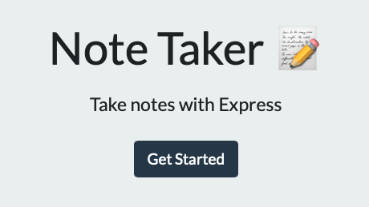
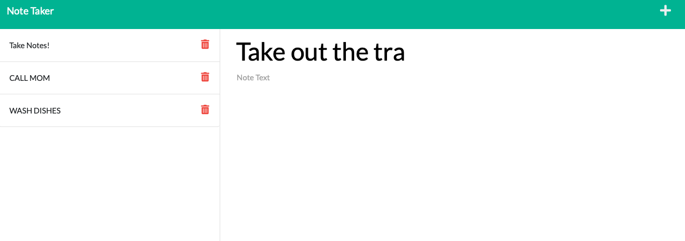

<!-- readme has snippets from https://github.com/othneildrew/Best-README-Template -->
<!-- badges are by the wonderful https://michaelcurrin.github.io/badge-generator/#/ -->

# Note Taker App

    
  

    <h3>Note Taker</h3>
     
    <a href="https://github.com/billycwong19/Note-Taker"><strong>Explore the docs »</strong></a>
     
     
    <a href="https://note-taker-thing.herokuapp.com">View Site</a>
    ·
    <a href="https://github.com/billycwong19/Note-Taker/issues">Report Bug</a>
    ·
    <a href="https://github.com/billycwong19/Note-Taker/issues">Request Feature</a>
  

  
Table of Contents

  <ol>
    <li>
      <a href="#about-the-project">About The Project</a>
    </li>
      <ul>
        <li><a href="#license">License</a></li>
        <li><a href="#contributing">Contributing</a></li>
        <li><a href="#contact">Contact</a></li>
      </ul>
    </li>
  </ol>

## About The Project

    

The Note Taker app is brought to life by Express and Node.js. By setting up routes and fetch requests, I was able to save data to a database, retrieve it, and delete it, using GET, POST, and DELETE. The HTML was already provided, so I acted as my own back-end development team supplying the proper routes for displaying and retrieving data. This website has been deployed to Heroku: <a href="https://note-taker-thing.herokuapp.com">View Site</a>.

(<a href="#top">back to top</a>)

### License

Distributed under the MIT License. See `LICENSE.txt` for more information.

(<a href="#top">back to top</a>)

### Contributing

Please feel free to contribute!

If you have a suggestion please open an issue then fork the repo and create a pull request.
1. Fork the Project
2. Create your Feature Branch (`git checkout -b feature/newFeature`)
3. Commit your Changes (`git commit -m 'Add some newFeature'`)
4. Push to the Branch (`git push origin feature/newFeature`)
5. Open a Pull Request

(<a href="#top">back to top</a>)

## Contact

Application coded by William Wong.
 
Email: billycwong19@gmail.com

Project Link: [https://github.com/billycwong19/Note-Taker](https://github.com/billycwong19/Note-Taker)

(<a href="#top">back to top</a>)

